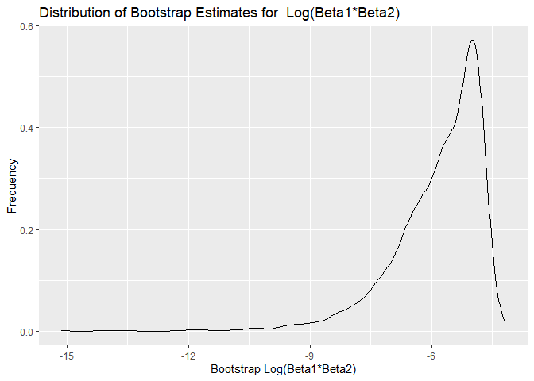
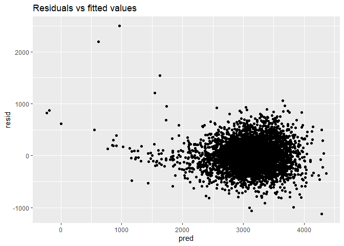
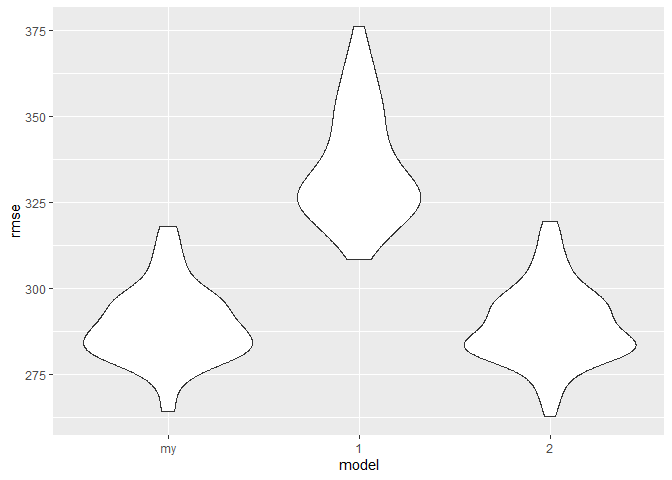

p8105_hw6_rl3401
================
Ruoxi Li
2023-12-02

## Problem 1

``` r
library(tidyverse)
```

    ## ── Attaching core tidyverse packages ──────────────────────── tidyverse 2.0.0 ──
    ## ✔ dplyr     1.1.3     ✔ readr     2.1.4
    ## ✔ forcats   1.0.0     ✔ stringr   1.5.0
    ## ✔ ggplot2   3.4.3     ✔ tibble    3.2.1
    ## ✔ lubridate 1.9.2     ✔ tidyr     1.3.0
    ## ✔ purrr     1.0.2     
    ## ── Conflicts ────────────────────────────────────────── tidyverse_conflicts() ──
    ## ✖ dplyr::filter() masks stats::filter()
    ## ✖ dplyr::lag()    masks stats::lag()
    ## ℹ Use the conflicted package (<http://conflicted.r-lib.org/>) to force all conflicts to become errors

``` r
library(broom)
library(purrr)
library(ggplot2)
```

Create a city_state variable and a binary variable indicating whether
the homicide is solved. Omit cities Dallas, TX; Phoenix, AZ; Kansas
City, MO and omit Tulsa, AL. Limit the analysis those for whom
victim_race is white or black. Be sure that victim_age is numeric.

``` r
homicide_df_raw = read.csv("data/homicide-data.csv")

homicide_df = homicide_df_raw |>
  mutate(city_state = paste(city, state, sep = ", "),
         solved = disposition == "Closed by arrest") |>
  filter(!city_state %in% c("Dallas, TX", "Phoenix, AZ", "Kansas City, MO", "Tulsa, AL"),
         victim_race %in% c("White", "Black")) |>
  mutate(victim_age = ifelse(victim_age == "Unknown", NA, victim_age)) |>
  mutate(victim_age = as.numeric(victim_age))
```

For the city of Baltimore, MD, use the glm function to fit a logistic
regression with resolved vs unresolved as the outcome and victim age,
sex and race as predictors and obtain the estimate and confidence
interval of the adjusted odds ratio for solving homicides comparing male
victims to female victims keeping all other variables fixed.

``` r
baltimore_df = homicide_df |>
  filter(city_state == "Baltimore, MD")

baltimore_model = glm(solved ~ victim_age + victim_sex + victim_race, 
                       data = baltimore_df, family = "binomial")

tidy_baltimore_model = tidy(baltimore_model)

gender_comparison = tidy_baltimore_model |>
  filter(term == "victim_sexMale")|>
  mutate(or = exp(estimate),
         lower_ci = exp(estimate - 1.96 * std.error),
         upper_ci = exp(estimate + 1.96 * std.error))|>
  knitr::kable()
```

Run glm for each of the cities in your dataset, and extract the adjusted
odds ratio (and CI) for solving homicides comparing male victims to
female victims.

``` r
city_models = homicide_df |>
  group_by(city_state) |>
  nest() |>
  mutate(model = map(data, ~glm(solved ~ victim_age + victim_sex + victim_race,
                                data = .x, family = "binomial"))) |>
  mutate(tidy_model = map(model, broom::tidy))

or_ci = city_models |>
  mutate(gender_comparison = map(tidy_model, ~.x |>
                                 filter(term == "victim_sexMale") |>
                                 mutate(or = exp(estimate),
                              lower_ci = exp(estimate - 1.96 * std.error),                                   upper_ci = exp(estimate + 1.96 * std.error)))) |>
  select(city_state, gender_comparison) |>
  unnest(gender_comparison)
```

Create a plot that shows the estimated ORs and CIs for each city.
Organize cities according to estimated OR, and comment on the plot.

``` r
ggplot(or_ci, aes(x = reorder(city_state, or), y = or)) +
  geom_point() +
  geom_errorbar(aes(ymin = lower_ci, ymax = upper_ci), width = 0.2) +
  coord_flip() +
  labs(x = "City", y = "Adjusted Odds Ratio", 
       title = "Adjusted Odds Ratios for Solving Homicides: Male vs Female Victims by City") +
  theme_minimal()
```

<!-- -->

## Problem 2

Load the data.

``` r
weather_df = 
  rnoaa::meteo_pull_monitors(
    c("USW00094728"),
    var = c("PRCP", "TMIN", "TMAX"), 
    date_min = "2022-01-01",
    date_max = "2022-12-31") |>
  mutate(
    name = recode(id, USW00094728 = "CentralPark_NY"),
    tmin = tmin / 10,
    tmax = tmax / 10) |>
  select(name, id, everything())
```

    ## using cached file: C:\Users\Lenovo\AppData\Local/R/cache/R/rnoaa/noaa_ghcnd/USW00094728.dly

    ## date created (size, mb): 2023-09-28 10:20:27.523071 (8.541)

    ## file min/max dates: 1869-01-01 / 2023-09-30

Fit a simple linear regression with `tmax` as the response with `tmin`
and `prcp` as the predictors.

``` r
lm = lm(tmax ~ tmin + prcp, data = weather_df)
   broom::tidy(lm)
```

    ## # A tibble: 3 × 5
    ##   term        estimate std.error statistic   p.value
    ##   <chr>          <dbl>     <dbl>     <dbl>     <dbl>
    ## 1 (Intercept)  8.04      0.230      35.0   4.39e-118
    ## 2 tmin         1.01      0.0162     62.7   1.43e-196
    ## 3 prcp        -0.00154   0.00210    -0.733 4.64e-  1

``` r
   broom::glance(lm)
```

    ## # A tibble: 1 × 12
    ##   r.squared adj.r.squared sigma statistic   p.value    df logLik   AIC   BIC
    ##       <dbl>         <dbl> <dbl>     <dbl>     <dbl> <dbl>  <dbl> <dbl> <dbl>
    ## 1     0.916         0.915  2.96     1972. 2.19e-195     2  -912. 1832. 1848.
    ## # ℹ 3 more variables: deviance <dbl>, df.residual <int>, nobs <int>

Use 5000 bootstrap samples and, for each bootstrap sample, produce
estimates of these two quantities.

``` r
res =   
  weather_df |> 
  modelr::bootstrap(n = 5000) |> 
  mutate(
    models = map(strap, \(df) lm(tmax ~ tmin + prcp, data = df)),
    results = map(models, broom::tidy),
    results2 = map(models, broom::glance)) |> 
  select(results, results2) |> 
  unnest(results2) |> 
  select(r.squared, results) |>
  unnest(results) |>
  select(term, estimate, r.squared) |>
  group_by(term) |>
  mutate(group_id = ceiling((row_number() ))) %>%
  ungroup() |>
  pivot_wider(
    names_from = term,
    values_from = estimate,
  ) |>
  mutate(log_bata = log ( tmin * abs(prcp)))
```

Identify the 2.5% and 97.5% quantiles to provide a 95% confidence
interval for $\hat{r}^2$ and $log(\hat{\beta_1} * \hat{\beta_2})$.

``` r
r_squared_ci <- quantile(res$r.squared, c(0.025, 0.975))

log_beta_ci <- quantile(res$log_beta, c(0.025, 0.975))
```

    ## Warning: Unknown or uninitialised column: `log_beta`.

draw the plot.

``` r
ggplot(res, aes(x = r.squared)) +
  geom_density()+
  labs(x = "Bootstrap R-squared)", y = "Frequency") +
  ggtitle("Distribution of Bootstrap Estimates for r̂²")
```

<!-- -->

The goodness of fit of a model can be measured by $\hat{r}^2$.

The plot is slightly left-skewed, with the range appears to be from just
below 0.88 to just below 0.95.

The highest frequency of values is around 0.92, which suggests that 0.92
is the most common estimate.

The curve is smooth, which suggests that the bootstrap samples were
large enough to provide a good approximation of the distribution.

``` r
ggplot(res, aes(x = log_bata)) +
  geom_density()+
  labs(x = "Bootstrap Log(Beta1*Beta2)", y = "Frequency") +
  ggtitle("Distribution of Bootstrap Estimates for  Log(Beta1*Beta2)")
```

<!-- -->

The logarithm of absolute values was used because $hat{\beta_2}$ was
negative, which cannot be directly logged.

A higher value in this range indicates a stronger influence of the two
factors.

The logarithmic values of the distribution range from approximately -9
to -4, indicating a broad spread in the influence of two factors. Most
values center around -5, suggesting a moderate influence. The
distribution is left-skewed, meaning there’s a higher frequency of
higher influence values.

## Problem 3

Load the data.

``` r
birthweight_df = read_csv('data/birthweight.csv') 
```

    ## Rows: 4342 Columns: 20
    ## ── Column specification ────────────────────────────────────────────────────────
    ## Delimiter: ","
    ## dbl (20): babysex, bhead, blength, bwt, delwt, fincome, frace, gaweeks, malf...
    ## 
    ## ℹ Use `spec()` to retrieve the full column specification for this data.
    ## ℹ Specify the column types or set `show_col_types = FALSE` to quiet this message.

``` r
sum(is.na(birthweight_df))
```

    ## [1] 0

There is no missing data. So next I converted numeric to factor where
appropriate.

``` r
birthweight_df$babysex <- as.factor(birthweight_df$babysex)
birthweight_df$frace <- as.factor(birthweight_df$frace)
birthweight_df$mrace <- as.factor(birthweight_df$mrace)
birthweight_df$malform <- as.factor(birthweight_df$malform)
```

Fit a linear regression model.

``` r
summary(birthweight_df)
```

    ##  babysex      bhead          blength           bwt           delwt      
    ##  1:2230   Min.   :21.00   Min.   :20.00   Min.   : 595   Min.   : 86.0  
    ##  2:2112   1st Qu.:33.00   1st Qu.:48.00   1st Qu.:2807   1st Qu.:131.0  
    ##           Median :34.00   Median :50.00   Median :3132   Median :143.0  
    ##           Mean   :33.65   Mean   :49.75   Mean   :3114   Mean   :145.6  
    ##           3rd Qu.:35.00   3rd Qu.:51.00   3rd Qu.:3459   3rd Qu.:157.0  
    ##           Max.   :41.00   Max.   :63.00   Max.   :4791   Max.   :334.0  
    ##     fincome      frace       gaweeks      malform     menarche    
    ##  Min.   : 0.00   1:2123   Min.   :17.70   0:4327   Min.   : 0.00  
    ##  1st Qu.:25.00   2:1911   1st Qu.:38.30   1:  15   1st Qu.:12.00  
    ##  Median :35.00   3:  46   Median :39.90            Median :12.00  
    ##  Mean   :44.11   4: 248   Mean   :39.43            Mean   :12.51  
    ##  3rd Qu.:65.00   8:  14   3rd Qu.:41.10            3rd Qu.:13.00  
    ##  Max.   :96.00            Max.   :51.30            Max.   :19.00  
    ##     mheight          momage     mrace        parity            pnumlbw 
    ##  Min.   :48.00   Min.   :12.0   1:2147   Min.   :0.000000   Min.   :0  
    ##  1st Qu.:62.00   1st Qu.:18.0   2:1909   1st Qu.:0.000000   1st Qu.:0  
    ##  Median :63.00   Median :20.0   3:  43   Median :0.000000   Median :0  
    ##  Mean   :63.49   Mean   :20.3   4: 243   Mean   :0.002303   Mean   :0  
    ##  3rd Qu.:65.00   3rd Qu.:22.0            3rd Qu.:0.000000   3rd Qu.:0  
    ##  Max.   :77.00   Max.   :44.0            Max.   :6.000000   Max.   :0  
    ##     pnumsga      ppbmi            ppwt           smoken           wtgain      
    ##  Min.   :0   Min.   :13.07   Min.   : 70.0   Min.   : 0.000   Min.   :-46.00  
    ##  1st Qu.:0   1st Qu.:19.53   1st Qu.:110.0   1st Qu.: 0.000   1st Qu.: 15.00  
    ##  Median :0   Median :21.03   Median :120.0   Median : 0.000   Median : 22.00  
    ##  Mean   :0   Mean   :21.57   Mean   :123.5   Mean   : 4.145   Mean   : 22.08  
    ##  3rd Qu.:0   3rd Qu.:22.91   3rd Qu.:134.0   3rd Qu.: 5.000   3rd Qu.: 28.00  
    ##  Max.   :0   Max.   :46.10   Max.   :287.0   Max.   :60.000   Max.   : 89.00

``` r
# exclude pnumlbw and pnumsga because all 0

test_fit =
  birthweight_df |>
  lm(bwt ~ babysex + bhead + blength + delwt + fincome + frace + gaweeks + malform + menarche + mheight + momage + mrace + parity + ppbmi + ppwt + smoken + wtgain, data = _) |>
  broom::tidy() |>
  filter(p.value < 0.01)

my_fit = 
  birthweight_df |>
  lm(bwt ~ mrace + blength + bhead+babysex+gaweeks, data = _)
```

I choose `bhead`, `blength`, `babysex`, `gaweeks` and `mrace` as the
predictors, because they have the largest absolute
coefficient(estimate\>10) estimate and a small p value(p\<0.01).

``` r
birthweight_df |>
  modelr::add_residuals(my_fit) |> 
  mutate(
    pred = modelr::add_predictions(birthweight_df, my_fit) |> pull(pred)
  ) |> 
  ggplot(aes(x = pred, y = resid)) + 
  geom_point() +
  labs(title = "Residuals vs fitted values")
```

<!-- -->

For most of the fitted values, residuals spread randomly around zero.
However, the residual distribution is slightly skewed and has some
extremely large outliers at small fitted value. This may suggest that
the model is still missing some important variables.

Compare the model to two others:

- One using length at birth and gestational age as predictors (main
  effects only)

- One using head circumference, length, sex, and all interactions
  (including the three-way interaction) between these

``` r
library(modelr)
```

    ## 
    ## 载入程辑包：'modelr'

    ## The following object is masked from 'package:broom':
    ## 
    ##     bootstrap

``` r
cv_df =
  crossv_mc(birthweight_df, 100) |> 
  mutate(
    train = map(train, as_tibble),
    test = map(test, as_tibble)) |>
  mutate(
    mod_my = map(train, \(df) lm(bwt ~ bhead + blength + smoken, data = df)),
    mod_1 = map(train, \(df) lm(bwt ~ blength + gaweeks, data = df)),
    mod_2 = map(train, \(df) lm(bwt ~ bhead + blength + babysex + bhead*blength + bhead*babysex + blength*babysex, data = df)) 
  )|> 
  mutate(
    rmse_my = map2_dbl(mod_my, test, \(mod, df) rmse(model = mod, data = df)),
    rmse_1 = map2_dbl(mod_1, test, \(mod, df) rmse(model = mod, data = df)),
    rmse_2 = map2_dbl(mod_2, test, \(mod, df) rmse(model = mod, data = df))
  ) 

cv_df |>
  select(starts_with("rmse")) |> 
  pivot_longer(
    everything(),
    names_to = "model", 
    values_to = "rmse",
    names_prefix = "rmse_") |> 
  mutate(model = fct_inorder(model)) |> 
  ggplot(aes(x = model, y = rmse)) + 
  geom_violin()
```

<!-- -->

From the plot, we can see that the performance of our model (using head
circumference, length and mother’s race) and the second model (using
head circumference, length, sex, and all interactions) are similar,
while both are significantly better than the first model (using length
at birth and gestational age, main effects only).
